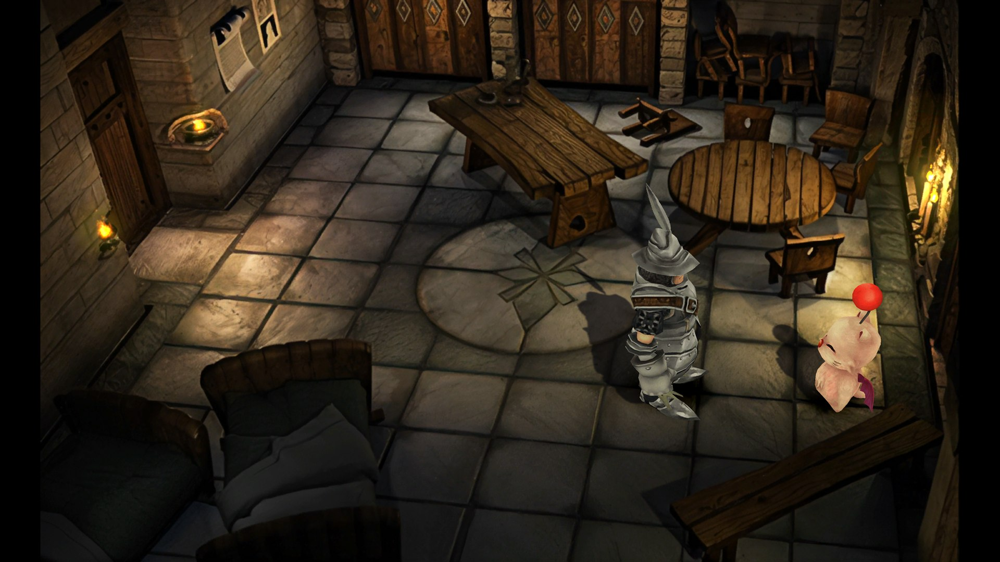

# Memoria — Dynamic Shadows

Real 3D lighting and dynamic shadows for the field maps of **Final Fantasy IX**.

The prerendered backgrounds stay exactly as they are. What this adds is a real 3D pass drawn on top
of them: the character receives the scene's light, casts a genuine shadow onto the geometry, darkens
when walking into shade, takes on the tint of a nearby torch, and occludes correctly against pillars
and walls.



_Map 150, `Cast. Alex./Guard`. The background is the game's own prerendered plate, untouched — the
shadow, and the way the light falls off across the floor, come from the 3D pass._

This is a **fork of [Albeoris/Memoria](https://github.com/Albeoris/Memoria)**, branch
`dynamic-shadows`. Memoria's own README lives
[upstream](https://github.com/Albeoris/Memoria/blob/main/README.md).

> **Status: work in progress.** Milestones 1–3 are done and verified (see
> [NOTES.md §9](NOTES.md)). Three maps ship with scenes: 64, 150 and 151. Any map
> without a scene plays exactly as it does without the mod.

---

## Requirements

|                     | Needed for               | Version                                                     |
| ------------------- | ------------------------ | ----------------------------------------------------------- |
| Final Fantasy IX    | everything               | the Steam or GOG release                                    |
| [Memoria][memoria]  | everything               | patch the game with `Memoria.Patcher` once                  |
| VS 2022 Build Tools | building the DLL         | with the C++ `v143` toolset — see [.vsconfig](../.vsconfig) |
| Unity Editor        | making or editing scenes | **5.2.3f1**, the exact version the game runs on             |
| Blender             | modelling scenery        | 5.x                                                         |

You only need the first two to _play_ it. Unity and Blender are for authoring new maps.

[memoria]: https://github.com/Albeoris/Memoria/releases/latest

---

## Getting the repo

```bash
git clone -b dynamic-shadows https://github.com/Egalestrenge/Memoria.git Memoria-DynamicShadows
cd Memoria-DynamicShadows
```

To keep up with upstream Memoria later:

```bash
git remote add upstream https://github.com/Albeoris/Memoria.git
git fetch upstream
git rebase upstream/main
```

The fork touches only **9 lines** of Memoria outside its own files, so that rebase is normally
uneventful. See [NOTES.md §0](NOTES.md).

---

## Installing

**1. Patch the game with Memoria first.** Download `Memoria.Patcher.exe` from a
[Memoria release][memoria] and run it. Launch the game once afterwards so it writes its
`Memoria.ini`. This mod replaces Memoria's `Assembly-CSharp.dll`; it does not replace Memoria.

**2. Build and deploy.** In PowerShell **as administrator** (the game lives in Program Files):

```powershell
.\DynamicShadows\Tools\build-and-deploy.ps1
```

That builds `Assembly-CSharp.dll`, copies it into `x64\FF9_Data\Managed\`, and deploys
`DynamicShadows/Mod/DynamicShadows/` into the game folder. If your game is somewhere else, pass
`-GamePath "D:\Games\FINAL FANTASY IX"`.

**3. Activate the mod.** Open the Memoria launcher, go to the Mod Manager and tick **Dynamic
Shadows**. Or add it by hand to `Memoria.ini`:

```ini
[Mod]
FolderNames = "DynamicShadows"
Priorities = "DynamicShadows"
```

The deploy script warns you if this step is missing. Load a save in **Cast. Alex./Guard (map 150)**
and Steiner should be casting a shadow on the floor.

### Useful flags

```powershell
.\DynamicShadows\Tools\build-and-deploy.ps1 -SkipBuild     # redeploy the mod without rebuilding
.\DynamicShadows\Tools\build-and-deploy.ps1 -EditConfig    # also drop the config in the game root
```

### If nothing happens

Check `Memoria.log` in the game folder:

| What you see                           | What it means                                              |
| -------------------------------------- | ---------------------------------------------------------- |
| no `[CustomFieldObjects]` lines at all | the mod is not active — check `[Mod] FolderNames`          |
| `[FieldSceneBundle] Bundle not found`  | the `.unity3d` did not deploy; rerun with `-SkipBuild`     |
| settings applied but no shadow         | check `PLAYER3D` is not `off` in `MemoriaFieldObjects.txt` |
| you rebuilt a scene and nothing changed | `Build Bundle` only writes into the repo — **deploy** with `-SkipBuild`, then **restart the game** |

### Compatibility

It replaces `Assembly-CSharp.dll`, so it is **incompatible with any other mod that also replaces
that DLL**. Data-only mods — textures, text, music, models, Moguri's backgrounds — coexist with it
without trouble.

---

## How it works

FFIX does not draw fields in 3D. Its camera is orthographic and essentially 2D, and perspective is
faked in the vertex shader of each PSX material. But `BGCAM_DEF` _does_ store a real 3D camera:
a rotation, a translation and a projection distance.

The mod derives a true perspective camera from that and draws a **second pass** after the game's,
clearing only the z-buffer:

```
FieldMap Camera  (orthographic, layer != 30)      <- the game, untouched
Field3D Camera   (derived perspective, layer 30 only, clearFlags = Depth)
  |__ Field3D Root                                 field coordinates
      |__ the player proxy
      |__ Field3D Scene                            your Unity scene, scaled by SCENESCALE
```

Three pieces make it work:

**The scenery is invisible.** Your Unity geometry uses the `Memoria/ShadowCatcher` shader, which
multiplies the framebuffer by the shadow attenuation. Where there is no shadow it multiplies by 1 —
the prerendered background comes through **identical, bit for bit**. Only what a shadow touches gets
darker. The same geometry writes depth, which is what gives real occlusion behind pillars.

**The character is copied into the 3D pass.** Every frame, their deformed mesh is baked with
`SkinnedMeshRenderer.BakeMesh` and copied to a proxy on layer 30. In the default `shadow` mode the
proxy is not drawn — it only puts the character's silhouette into the shadow map — so what you see
is still the game's own render.

**Lighting reaches the character through the game's own material.** `CHARLIGHT` multiplies the
`_Color` the game already draws them with, so they keep their exact colours, alpha cutout and
ordering, and only darken or take on a nearby light's hue.

The camera reconstruction is exact to **0.06 px** on map 150, verified against the game's own
projection. The full derivation, and the traps that make it easy to get wrong, are in
[NOTES.md](NOTES.md).

### What is in the mod folder

```
DynamicShadows/Mod/DynamicShadows/
  ModDescription.xml         what the Mod Manager shows
  MemoriaFieldObjects.txt    all the settings, re-read on every map load
  DictionaryPatch.txt        registers the debug cube model
  150.unity3d                one bundle per map, named after the map number
  151.unity3d
  64.unity3d
```

`MemoriaFieldObjects.txt` is the control panel: ambient colour, shadow distance, `CHARLIGHT`, the
player proxy mode and the diagnostics. It is **re-read every time a map loads**, so you can tune it
with the game running — edit, leave the map, walk back in. A copy in the game root takes priority
over the mod's, which is the intended way to experiment without touching the mod. Every setting is
documented in the file itself, and summarised in [NOTES.md §6](NOTES.md).

---

## Adding a new scenario

The scene for map `N` is a Unity scene saved as `N.unity`; the bundle it builds is `N.unity3d` and
the mod picks it up automatically. **The file name is the configuration** — there is no list to
maintain.

Currently it only has three scenarios of Alexandria that I've used for testing purposes. The idea is to
leave the rest to the community and create the rest of the scenarios of the game!

### 1. Dump the map from the game

With `EXPORTSCENE` in `MemoriaFieldObjects.txt`, walking into a map writes
`<game>/MemoriaSceneExport/<map>/`: the camera (`field.json`), a clean background plate
(`background.png`) and the collision mesh (`walkmesh.obj`).

It has to be dumped at runtime and not from the game files, because the framing depends on your
resolution.

### 2. Generate the Blender project

```powershell
.\DynamicShadows\Tools\make-blend-projects.ps1
```

This builds a `.blend` for every dumped map that does not have one yet, with the camera placed
exactly as the game's, the background as camera layers, and the walkmesh in wireframe. All in
metres.

It **verifies itself**: it reprojects the walkmesh through the Blender camera and compares against
the game. Anything above 1 px of deviation is reported. Existing projects are never overwritten,
because they may hold modelling work.

> **If you re-export a map, its project goes stale.** The camera, the render resolution and the
> background image in the `.blend` all come from `field.json`, and that depends on the resolution
> you were playing at. Play at a different resolution, re-export, and the project no longer matches
> the game — nothing errors, the viewport just stops lining up. Your modelling is unaffected: the
> geometry is in metres and stays valid.
>
> The script reports any project older than its export and refreshes them with `-Update`, which
> preserves everything you have modelled:
>
> ```powershell
> .\DynamicShadows\Tools\make-blend-projects.ps1 -Update
> ```
>
> One limitation: on a map with more than one BGCAM, `-Update` only refreshes camera 0 and says so.
> The other cameras need a rebuild from scratch.

### 3. Model the scenery

Press Numpad 0 to look through the camera and model over the background. Put everything in the
**`Scenery`** collection so every camera of the map sees it.

You do not have to rebuild the room. The cheapest useful scene is a floor, the walls and one pillar:
none of it is drawn, it only catches the shadow and provides occlusion.

Anything resting on the floor must have its minimum Z at zero — that is where the walkmesh is.
`update_field_project.py` prints the height of each object so you can check.

### 4. Light it in Unity

In Unity **5.2.3f1**, open `DynamicShadows/Unity/DynamicShadows/`:

1. Import your FBX and place it **without moving it** — the coordinates are already correct.
2. Add your lights. Every light that should cast needs its Shadow Type set.
3. Run **`Dynamic Shadows > Setup Scene`**. This puts the shadow catcher material on all the
   geometry, creates the materials if needed, and leaves the carrier object that ships the character
   shader inside the bundle. It is safe to run repeatedly.
4. Bake if you want baked lighting: `Baked GI` on, `Precomputed Realtime GI` off,
   `Window > Lighting > Build`.
5. Save the scene as **`<map number>.unity`**.

### 5. Build the bundle, then deploy it

**`Dynamic Shadows > Build Bundle`** writes `<map>.unity3d` into `DynamicShadows/Mod/DynamicShadows/`
— the mod folder **in the repo**. That is not the folder the game reads, so building alone changes
nothing in game. Deploy it:

```powershell
.\DynamicShadows\Tools\build-and-deploy.ps1 -SkipBuild
```

Then **restart the game.** Bundles stay open for the whole session, because `CreateFromFile` refuses
to open the same file twice, so a running game will never pick up a rebuilt one.

> Both steps fail silently if you skip them: the game just keeps showing the previous version of
> your scene, with no error anywhere. If a change does not show up, compare the two files before
> suspecting the scene —
> `DynamicShadows\Mod\DynamicShadows\150.unity3d` against
> `<game>\DynamicShadows\150.unity3d`. Different timestamps mean you have not deployed; identical
> ones mean you have not restarted.

### 6. Check it

Walk into the map and read `Memoria.log`. `[FieldSceneBundle] Opened '.../DynamicShadows/<map>.unity3d'`
means it loaded. The loader also reports colliders, converted light ranges and which shader SubShader
ended up active — all things that fail silently otherwise.

If the shadow is missing, `CATCHERDEBUG 1..4` isolates each term of the calculation so you can see
_which_ one is dead rather than guessing. See [NOTES.md §5.2c](NOTES.md).

---

## Repo layout

```
Assembly-CSharp/Memoria/Field/     the engine code of the 3D pass
  FieldPerspectiveCamera.cs        camera derivation, 3D pass, character proxy, lighting
  CustomFieldObjects.cs            configuration, object spawning, diagnostics
  FieldSceneBundle.cs              loading and adopting the Unity scene bundles
  FieldSceneExport.cs              dumping a map for Blender (EXPORTSCENE)

DynamicShadows/
  NOTES.md                         the detailed handover document — read this before changing anything
  Mod/DynamicShadows/              the mod exactly as it installs
  Unity/DynamicShadows/            Unity 5.2.3f1 project: scenes, shaders, editor menus
  Tools/                           build script, Blender generators, FBX utilities
```

Everything else in the repo is Memoria upstream.

---

## Why this cannot be a normal Memoria mod

Memoria's Mod Manager installs **data** folders; it does not load assemblies. There is no Harmony and
no BepInEx — Memoria _is_ the game's `Assembly-CSharp.dll`, rewritten. The 3D pass is engine code, so
it has to ship as a DLL, which is why this is a fork and why it conflicts with other DLL-replacing
mods.

The clean way out is for the code to land _inside_ Memoria via an upstream pull request. This mod
would then become data only, and the conflict would disappear. Keeping the diff at 9 lines outside
its own files is deliberate groundwork for exactly that.

---

## License

MIT, inherited from [Memoria](https://github.com/Albeoris/Memoria) — see [LICENSE](../LICENSE).
